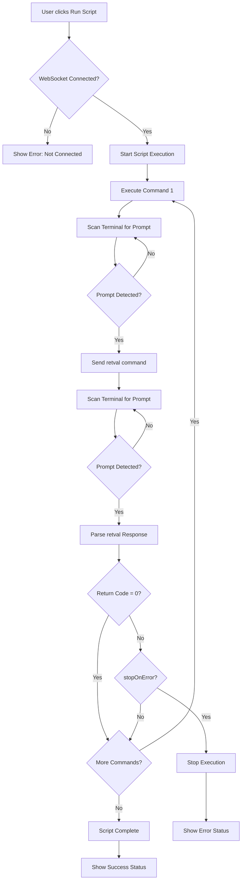

# Zephyr Shell Scripts Feature Implementation

## Overview

Add a shell scripts feature that allows users to:

- Import command files (.txt) and save them as named scripts
- Store scripts in localStorage with import/export capability
- Execute scripts from the Tools panel
- Use `retval` command to check return codes after each command
- Configure per-script whether to stop on error

## Architecture

### Data Model

Scripts will be stored in localStorage as `zfield_shell_scripts` with the following structure:

```javascript
{
  id: string,           // Unique identifier
  name: string,         // User-friendly name
  commands: string[],    // Array of command strings
  stopOnError: boolean  // Whether to stop execution on non-zero return code
}
```


### Execution Flow




### Prompt Detection

Each session will maintain a `promptString` property that stores the actual prompt (e.g., "uart:~$"). The prompt is detected from the initial terminal output when a session connects. During script execution, the terminal output is scanned for this prompt string to determine when a command has finished executing.

## Implementation Details

### 1. Frontend Data & State Management

**File: `frontend/js/app.js`**Add to Alpine.js data:

- `shellScripts: []` - Array of script objects
- `scriptModalData: {}` - Data for create/edit modal
- `runningScript: null` - Currently executing script (id)
- `scriptExecutionState: {}` - Track execution state per script

**Session Prompt String:**

- Add `promptString: ''` property to each session object
- Detect and store prompt string from initial terminal output when session connects
- Prompt detection: Look for patterns like "uart:~$", ">", "#" at end of lines

Add methods:

- `initShellScripts()` - Load from localStorage
- `saveShellScripts()` - Save to localStorage
- `openScriptModal(script, isEdit)` - Open create/edit modal
- `addShellScript()` - Add or update script
- `removeShellScript(id)` - Delete script
- `importScriptFile(event)` - Handle file import
- `exportScript(script)` - Export script as .txt file
- `detectPromptString(session)` - Detect and store prompt string from terminal output
- `waitForPrompt(session, timeout)` - Wait for prompt to appear in terminal output (returns Promise)
- `executeScript(script, session)` - Execute script with retval checking
- `parseRetvalResponse(data)` - Extract return code from retval output
- `checkRetvalAvailable()` - Check if retval command exists (optional)

### 2. UI Components

**File: `frontend/index.html`**

#### Tools Menu Addition

Add "Shell Scripts" menu item to Tools dropdown (after "Repeat Commands")

#### Scripts View

Create new view `activeView === 'scripts'` similar to repeat commands view:

- Header with title and "+" button
- List of scripts with:
- Script name
- Command count badge
- Stop on error indicator
- Run button
- Edit button
- Delete button
- Export button
- Empty state message

#### Script Editor Modal

Create `activeView === 'scripts-create'` view:

- Name input field
- File import button (hidden file input)
- Textarea for commands (one per line)
- Checkbox: "Stop on error"
- Save/Cancel buttons

### 3. Script Execution Logic

**File: `frontend/js/app.js`**The `executeScript()` method will:

1. Check WebSocket connection
2. Ensure session has `promptString` (detect if missing)
3. Set `runningScript` to script id
4. Iterate through commands sequentially
5. For each command:

- Send command via WebSocket: `command + '\n'`
- Call `waitForPrompt(session)` to wait for prompt to appear (indicates command finished)
- Send `retval\n` to check return code
- Call `waitForPrompt(session)` again to wait for retval command to finish
- Parse retval response from terminal output (expecting numeric output like "0" or "1")
- If non-zero and `stopOnError === true`, stop execution

6. Clear `runningScript` on completion or error
7. Show status messages

**Prompt Detection Implementation:**

- `waitForPrompt(session, timeout)` monitors the session's terminal output buffer
- Scans for the session's `promptString` at the end of the output
- Uses polling (check every 50-100ms) until prompt is detected or timeout
- Returns Promise that resolves when prompt is found

**Retval Parsing:**

- Listen for retval command output in WebSocket message handler
- Extract numeric value from response (handle various formats)
- Default to continuing if retval parsing fails (graceful degradation)

### 4. File Import/Export

**Import:**

- Use hidden `<input type="file" accept=".txt">` element
- Read file content using FileReader API
- Split by newlines to create commands array
- Filter empty lines and comments (optional: lines starting with `#` or `rem`)
- Populate script editor with imported commands

**Export:**

- Convert script commands array to text (join with newlines)
- Create blob and trigger download
- Filename: `{scriptName}.txt`

### 5. Integration Points

**WebSocket Message Handler:**

- Terminal output is already captured in session terminal buffer
- Prompt detection scans this buffer for the session's `promptString`
- Retval parsing extracts numeric return code from terminal output after retval command executes
- No changes needed to WebSocket handler itself - prompt detection works on existing terminal data

**Tools Menu:**

- Add "Shell Scripts" option that sets `activeView = 'scripts'`

**Sidebar Icon (Optional):**

- Consider adding scripts icon to sidebar icons array for quick access

## Files to Modify

1. **`frontend/index.html`**

- Add "Shell Scripts" to Tools menu
- Add scripts view UI
- Add script editor modal UI
- Add hidden file input for import

2. **`frontend/js/app.js`**

- Add shell scripts data and state
- Add `promptString` property to session objects
- Add prompt detection logic (`detectPromptString()`, `waitForPrompt()`)
- Add initialization and persistence methods
- Add script CRUD methods
- Add file import/export methods
- Add script execution logic with prompt-based command completion detection
- Add retval parsing from terminal output

## Error Handling

- **Retval command not available:** Continue execution without error checking (show warning)
- **WebSocket disconnected:** Stop execution, show error
- **Invalid script:** Validate before saving (non-empty name, at least one command)
- **File import errors:** Show user-friendly error messages
- **Execution errors:** Catch and display errors, ensure cleanup

## Testing Considerations

- Test with scripts containing 1, multiple, and many commands
- Test stopOnError=true with failing command
- Test stopOnError=false with failing command
- Test retval parsing with various output formats
- Test file import with different formats (Windows/Unix line endings)
- Test prompt detection with different prompt formats ("uart:~$", ">", "#", etc.)
- Test prompt detection when prompt changes during session
- Test script execution when disconnected
- Test script execution with missing prompt string (should auto-detect)
- Test concurrent script execution (should be prevented or queued)

## Future Enhancements (Out of Scope)

- Script variables/parameters
- Conditional execution